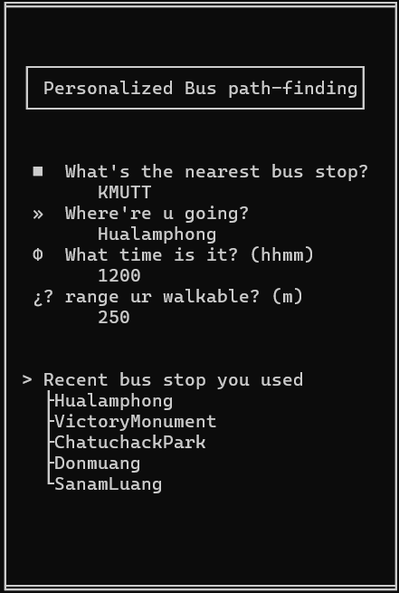
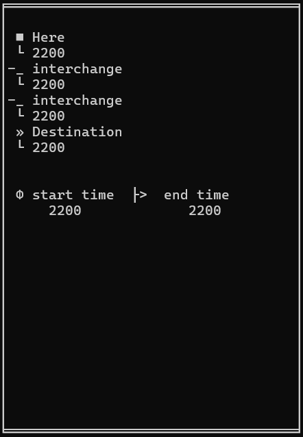

# Personalized Bus path finfing

this project is a part of CPE112-Data Structure, the aims is to find the shortest path which is the weight of whole graph is *time* 

### Our collected data
- **86 bus routes** in bangkok (only our scope below)
- approximately **3,000 different bus stop** name and location
- **distances from origin to destination** of each route
- the **time taking from origin to destination** of each route
- **distance between every connected bus stop** 

#### Our scope area

### The solution we used to solve this problem
- dijkstra algorithm

### The UI of this program will be look like:
- home
  

- path
  

- show route